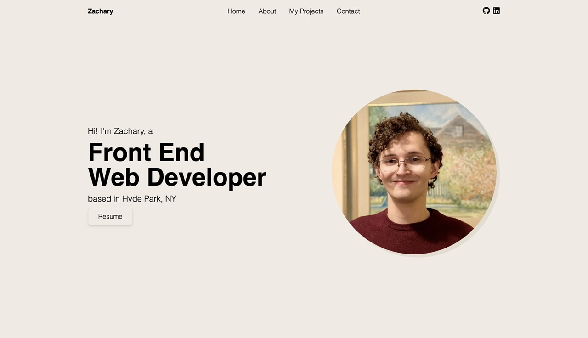

<h1 style="text-align:center">Zachary Maynor's Portfolio</h1>

 This is my first personal web development portfolio!  
Built with [Gatsby](https://www.gatsbyjs.com/) and hosted with [Netlify](https://www.netlify.com/) 

 

 

Here you can learn about who I am and what my goals are as a web developer.
You can view some of the projects that I am proud of, even view my design-to-code challenges.
Feel free to send me an email sometime!

 

 

# Roadmap

- add design-to-code section
- setup email form functionality
  - validation
- create custom logo
- add the ability to click on projects and be taken to them externally
- add a minimum of 2 full projects not included the portfolio
- replace all lorem ipsum with data
- shorten about section 50-100words
